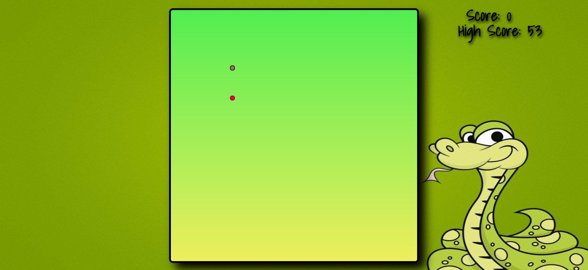

# Snake Game
Snake Game is one of the most famous games that we used to play in our child. So, here I have designed a simple Snake Game using HTML, CSS, JavaScript. 

## Build With :
<ul>
    <li><a href="https://www.w3schools.com/html/" target="_blank">HTML</a></li>
    <li><a href="https://www.w3schools.com/css/" target="_blank">CSS</a></li>
    <li><a href="https://www.w3schools.com/js/" target="_blank">JavaScript</a></li>
</ul>

## Install and Run :
<ol>
    <li>Download the code and extract the zip file.</li>
    <li>Open the folder and double on the file named as <i>"index.html"</i> .</li>
    <li>You will see the page.</li>
    <li>Just press any key in the keyboard to start the game.</li>
    <li>Use arrow key to move Up/Down/Left/Right</li>
</ol>

## Instruction of Game :
<ol>
    <li>Eat the food to grow the snake and break the highscore.</li>
    <li>If the snake eat itself game will be over.</li>
    <li>If the snake collide into the wall game will be over.</li>
    <li>Speed to the snakes increases after every consicutive multiple of 10.</li>
</ol>

## Screenshot :
<ul>
    <li>Start of Game :   </li>
    <li>Game Over :   </li>
</ul>

